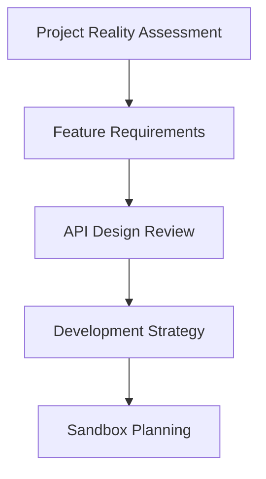
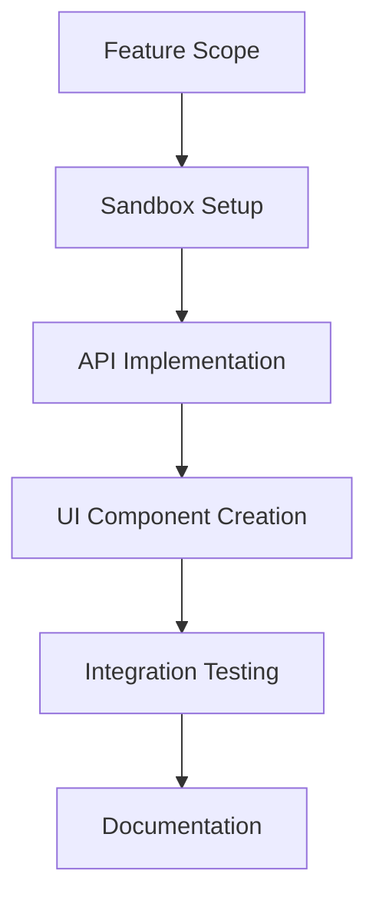
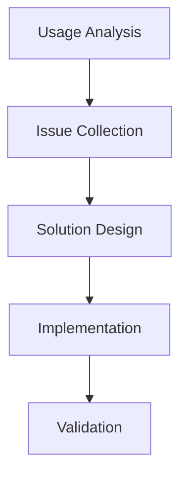

# Development Pipeline Orchestration

## Overview
This guide structures how to use our development prompts in a pipeline fashion, optimizing LLM interactions for effective feature development and project improvement.

## Pipeline Structure

### 1. Vision & Analysis Pipeline


Use prompts:
1. `0-core-vision/project-reality.md` - Initial assessment
2. `0-core-vision/sandbox-development.md` - Feature planning
3. `0-core-vision/endpoint-review.md` - API evaluation

### 2. Feature Development Pipeline


Use prompts:
1. `0-core-vision/sandbox-development.md` - Feature scoping
2. `0-core-vision/iterative-development.md` - Implementation cycle
3. `0-core-vision/endpoint-review.md` - Testing & validation

### 3. Improvement Pipeline


Use prompts:
1. `0-core-vision/endpoint-review.md` - Analysis
2. `0-core-vision/iterative-development.md` - Solutions
3. `0-core-vision/sandbox-development.md` - Validation

## LLM Interaction Guidelines

### 1. Initial Development
```
LLM Prompt Chain:
1. "Using project-reality.md, analyze current state of [feature/component]"
2. "Using sandbox-development.md, design test environment for [endpoint]"
3. "Using iterative-development.md, plan implementation steps"
4. "Using endpoint-review.md, validate implementation"
```

### 2. Feature Enhancement
```
LLM Prompt Chain:
1. "Using endpoint-review.md, analyze current endpoint usage"
2. "Using sandbox-development.md, design tests for improvements"
3. "Using iterative-development.md, implement changes"
4. "Using project-reality.md, validate against project goals"
```

### 3. Integration Development
```
LLM Prompt Chain:
1. "Using project-reality.md, identify integration requirements"
2. "Using sandbox-development.md, design integration tests"
3. "Using endpoint-review.md, validate integrations"
4. "Using iterative-development.md, refine implementation"
```

## Pipeline Usage Examples

### 1. New Feature Development
```
Step 1: Vision Alignment
LLM: Use project-reality.md to analyze feature fit
Output: Feature requirements and API design

Step 2: Sandbox Creation
LLM: Use sandbox-development.md to design test environment
Output: Test scenarios and UI components

Step 3: Implementation
LLM: Use iterative-development.md for development cycle
Output: Working implementation with tests

Step 4: Validation
LLM: Use endpoint-review.md to validate
Output: Validation report and improvements
```

### 2. API Enhancement
```
Step 1: Analysis
LLM: Use endpoint-review.md to analyze current state
Output: Issues and improvement areas

Step 2: Solution Design
LLM: Use sandbox-development.md to design tests
Output: Test cases and validation criteria

Step 3: Implementation
LLM: Use iterative-development.md for changes
Output: Updated implementation

Step 4: Verification
LLM: Use project-reality.md to verify alignment
Output: Validation report
```

## Best Practices

1. **Prompt Chaining**
   - Start with project-reality.md for context
   - Use sandbox-development.md for specific features
   - Apply iterative-development.md for implementation
   - Validate with endpoint-review.md

2. **LLM Interaction**
   - Provide clear context from previous steps
   - Reference specific sections of prompts
   - Request concrete outputs
   - Maintain development history

3. **Documentation**
   - Document LLM interactions
   - Save generated solutions
   - Track improvement suggestions
   - Update prompt templates based on learnings

4. **Validation**
   - Test each step's output
   - Verify against project goals
   - Document findings
   - Update development approach

## Pipeline Maintenance

1. **Regular Reviews**
   - Evaluate prompt effectiveness
   - Update templates based on usage
   - Refine LLM interaction patterns
   - Document successful patterns

2. **Continuous Improvement**
   - Collect feedback on pipeline usage
   - Identify bottlenecks
   - Optimize prompt sequences
   - Update documentation 